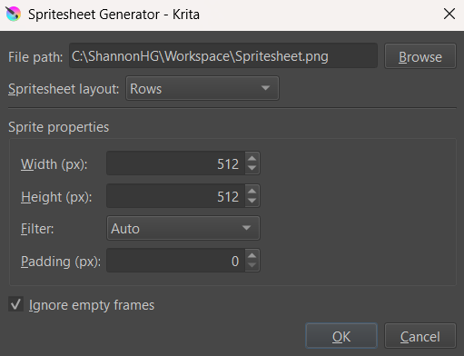

# Krita Spritesheet Generator
A Krita plugin capable of exporting the frames in the animation timeline as a spritesheet.

## Installation
Use the following steps to install the **Spritesheet Generator** plugin and make it available in Krita:

1. Download this repository as a ZIP file by using the **Code -> Download ZIP** option on GitHub
2. Open Krita and navigate to **Settings -> Manage Resources**
3. Click the **Open Resources Folder** button to access your Krita resources folder
4. Unzip the previously download ZIP file
5. Copy and paste the `spritesheetgenerator/` folder and the `spritesheetgenerator.desktop` file into the `pykrita/` directory in your Krita resources folder
6. Close and reopen Krita
7. Navigate to **Settings -> Configure Krita -> Python Plugin Manager**
8. Find **Spritesheet Generator** in the list of plugins and enable it by checking its checkbox
9. You should now be able to access **Spritesheet Generator** from the **Tools -> Scripts** menu. If you're still unable to see it, then you may need to restart Krita.

## Usage
After installation, the **Spritesheet Generator** can be opened by navigating to **Tools -> Scripts -> Spritesheet Generator**. See below for details on the various options that can be configured.

* **File path:** The file path that the spritesheet will be exported to. The **Browse** button can be used to open the computer's native file manager.

* **Spritesheet layout:** Determines how the sprites will be organized in the spritesheet.
    * **Rows:** Consecutive sprites will be placed in the same row. Once the row is full, the process will be repeated for the following rows.
    * **Columns:** Consecutive sprites will be placed in the same column. Once the column is full, the process will be repeated for the following columns.
    * **Horizontal Strip:** Sprites will be organized into a single horizontal line.
    * **Vertical Strip:** Sprites will be organized into a single vertical line.

* **Sprite dimensions:** Options related to the individual size of each sprite in the spritesheet.
    * **Width:** The desired width of each individual sprite. If this is different than the width of the current document, then the sprites will be resized before being placed in the spritesheet.
    * **Height:** The desired height of each individual sprite. If this is different than the height of the current document, then the sprites will be resized before being placed in the spritesheet.
    * **Filter:** The algorithm that will be used to resize the sprites (if needed).

* **Ignore empty frames:** If enabled (default), empty frames in the animation timeline will not be included in the spritesheet.